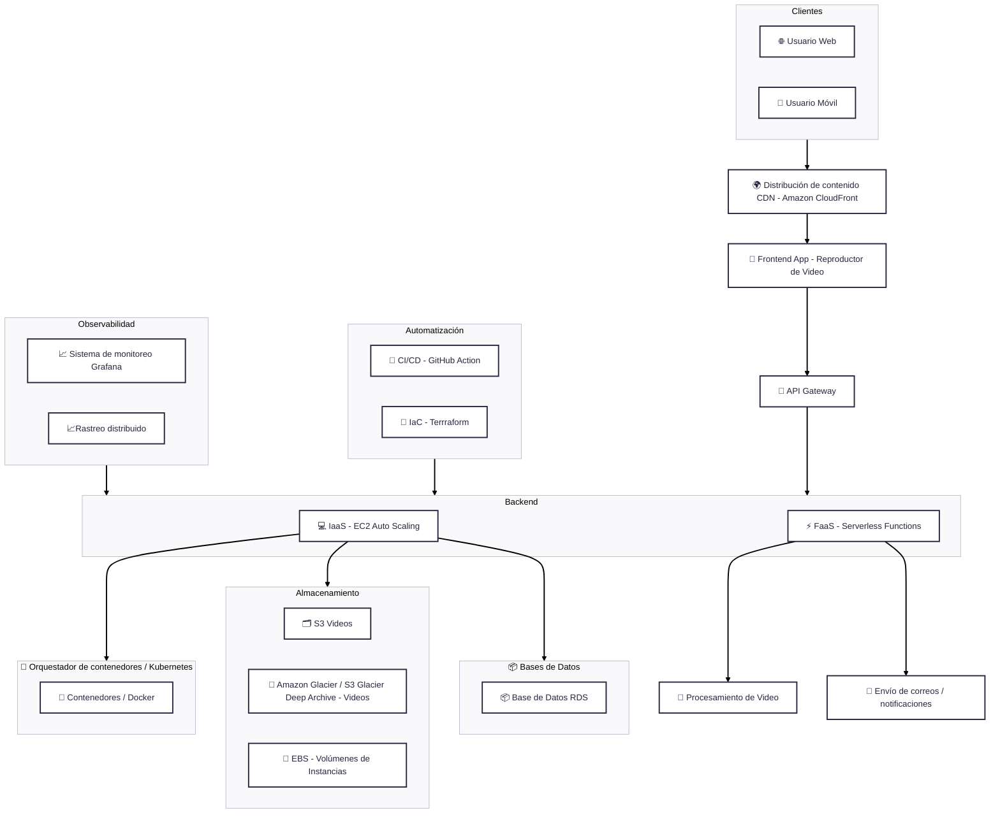

---
---
# 🎬 Caso plataforma de **Video Bajo Demanda (VOD)** en la Nube 
---
---
## 📌 Descripción del Proyecto

Una empresa de tecnología planea desarrollar una plataforma de **Video Bajo Demanda (VOD)** similar a Netflix.

## 🎯 Objetivo

Ofrecer a los usuarios una experiencia fluida de reproducción de contenidos en **múltiples dispositivos**, con alta disponibilidad y rendimiento.

### ☁️ Requisitos de Infraestructura

Se requiere diseñar una **infraestructura en la nube** que sea:

- 🔄 **Escalable**, para soportar miles de usuarios simultáneamente.
- 🔐 **Segura**, protegiendo tanto datos como transmisiones.
- 🌍 **Globalmente disponible**, garantizando acceso desde cualquier ubicación.

## 🚧 Desafío

Definir una estrategia integral para la implementación de:

- 📦 Servicios de almacenamiento
- 🖥️ Recursos de cómputo
- 🌐 Redes y conectividad
- ⚙️ Automatización con CI/CD
- 🧱 Infraestructura como código (IaC)

Todo esto utilizando **tecnologías cloud modernas**, que aseguren eficiencia operativa, mantenibilidad y escalabilidad a largo plazo.

--- 

## ☁️ Diseño de la infraestructura en la nube 

Este diagrama describe la arquitectura de una Plataforma de Video Bajo Demanda (VOD).

### 📋 Componentes del diagrama 

| 🧩 Componente                          | 💡 Función Principal                                                                    |
|--------------------------------------|------------------------------------------------------------------------------------------|
| 🌐 Usuario Web / 📱 Usuario Móvil     | Clientes que consumen contenido desde aplicaciones web o móviles                         |
| 🌍 CDN - Amazon CloudFront           | Distribuye globalmente los videos con baja latencia                                      |
| 🎥 Frontend App - Reproductor de Video| Interfaz para reproducir contenido y comunicarse con la API Gateway                      |
| 🧩 API Gateway                        | Puerta de entrada a los servicios backend                                                |
| 💻 EC2 Auto Scaling                   | Infraestructura elástica que ajusta capacidad según la demanda                           |
| ⚡ FaaS - Serverless Functions        | Ejecuta tareas específicas (procesamiento de video, envío de notificaciones)             |
| 🗂️ S3 Videos                         | Almacén principal de videos activos                                                      |
| 🧊 Glacier / Glacier Deep Archive    | Archivado de contenido menos frecuente o histórico                                       |
| 💽 EBS Volúmenes                      | Almacenamiento persistente para instancias EC2                                           |
| 📦 RDS                                | Gestión de datos transaccionales mediante bases de datos relacionales                    |
| 🐳 Docker + Kubernetes                | Orquestación eficiente de contenedores para servicios backend                            |
| 🚀 GitHub Actions                     | Automatización CI/CD para integrar y desplegar cambios de forma continua                |
| 📐 Terraform                          | Infraestructura como código para aprovisionamiento programático                          |
| 📈 App de monitoreo / Rastreo Distribuido     | Observabilidad del sistema (monitoreo + tracing de servicios y rendimiento)             |

## ☁️ ¿Que modelo de implementación en la nube (Pública, Privada o Híbrida) elegir? 

Los modelos de implementación en la nube definen cómo se alojan y gestionan los recursos de computación (servidores, almacenamiento, redes, etc.). Hay tres tipos principales: 

| Tipo de Nube    | Descripción                                                                                          | Ventajas                                                                                 | Desventajas                                                |
|-----------------|------------------------------------------------------------------------------------------------------|------------------------------------------------------------------------------------------|-------------------------------------------------------------|
| **Pública**     | Servicios ofrecidos por proveedores como AWS, Azure o GCP. Compartidos entre múltiples clientes.     | - Escalabilidad rápida - Costos bajos - Fácil de implementar                       | - Menor control - Seguridad depende del proveedor        |
| **Privada**     | Infraestructura exclusiva para una organización, on-premise o administrada por un tercero.           | - Control total - Mayor seguridad - Cumplimiento normativo                         | - Costos altos - Mayor complejidad de gestión            |
| **Híbrida**     | Combina nube pública y privada, permitiendo mover cargas según necesidades.                          | - Equilibrio entre costo y control - Flexibilidad - Aislamiento de cargas críticas | - Requiere integración compleja - Gestión más avanzada   |

## ✅ Recomendación elegida: Nube Pública
Una plataforma como VOD que requiere escalabilidad masiva, disponibilidad global y capacidad de entrega de contenido de baja latencia. La nube pública es insuperable en estos aspectos debido a su infraestructura distribuida globalmente, servicios gestionados especializados y modelo de pago por uso.

| Razon                                  | Descripción                                                                                                                                      |
|----------------------------------------|--------------------------------------------------------------------------------------------------------------------------------------------------|
| **Escalabilidad masiva e instantánea** | Ideal para plataformas VOD con picos de tráfico impredecibles (lanzamientos, eventos). La nube pública escala automáticamente según demanda.    |
| **Costo-efectividad**                  | Modelo de pago por uso. Permite comenzar con baja inversión y escalar según el crecimiento, evitando costos fijos de infraestructura.           |
| **Alta disponibilidad y rendimiento**  | Las regiones y zonas de disponibilidad aseguran tolerancia a fallos, baja latencia y continuidad operativa a escala global.                     |
| **Servicios gestionados integrados**   | Acceso a herramientas avanzadas como bases de datos escalables, balanceadores, servicios de streaming, seguridad, monitoreo, etc.               |
| **Automatización y DevOps**            | Soporte completo para:                                                                                                                           |
|                                        | - **Infraestructura como código** (Terraform, Pulumi, CloudFormation)                                                                            |
|                                        | - **CI/CD** (GitHub Actions, GitLab CI, AWS CodePipeline)                                                                                        |
|                                        | - **Observabilidad** (Prometheus, Grafana, CloudWatch)                                                                                           |
|                                        | - **Almacenamiento** (S3)                                                         |

> En caso de ser necesario, se podría optar por una nube híbrida, que permite mantener en una nube privada los componentes críticos o datos sensibles (por motivos regulatorios o de seguridad), mientras se aprovecha la escalabilidad y el alcance global de la nube pública para el streaming de video y la experiencia del usuario.

## ✅ Modelo de servicio principal a usar: IaaS (Infraestructura como Servicio)

📌 Proveedor: Amazon Web Services (AWS)

  - Amazon EC2 para cómputo.

  - Amazon S3 para almacenamiento de objetos.

  - Amazon VPC para redes privadas virtuales.

## 🔁 Otros servicios como complemento:
| Modelo	| Uso                                                 | Ejemplos                                                          |
|---------------|--------------------------|--------------------------------------------------------------------------------------------------------------------------------|
| PaaS	  | Limitado, solo para servicios internos específicos.	| Herramientas propias como GitHub Action (CI/CD).                  |
| FaaS	  | Usado en tareas puntuales.	                        | Funciones Lambda para notificaciones, procesamiento de logs, etc. |
| SaaS	  | Usado en herramientas de soporte.	                  | Slack, GitHub, etc.                                               |

Este enfoque le da máximo control, flexibilidad y rendimiento, ideal para una empresa de escala global.

## 📦 ¿Cómo manejar el almacenamiento en la nube?

| Servicio de Almacenamiento | Tipo de Almacenamiento | Uso Principal                                                            | Contenido Almacenado / Archivado                                                                     | Ventajas Clave                                                                                                                                                                          |
| :------------------------- | :--------------------- | :------------------------------------------------------------------------------------- | :--------------------------------------------------------------------------------------------------- | :------------------------------------------------------------------------------------------------------------------------------------------------------------------------------------ |
| **Amazon S3** | Almacenamiento de Objetos | Principal para contenido multimedia, backups y distribución.                             | Archivos de video master y transcodificados, subtítulos, miniaturas, imágenes promocionales, archivos estáticos, backups de logs y métricas. | Alta durabilidad, escala automáticamente a petabytes, integración con CloudFront (CDN) y Lambda, ideal para datos inmutables como archivos de video.                     |
| **Amazon Glacier / S3 Glacier Deep Archive** | Archivado de Contenido | Almacenamiento de largo plazo y bajo costo.                                            | Versiones antiguas de películas, contenido no popular, backups de larga duración, datos de cumplimiento o históricos.                                                                     | Muy bajo costo por GB, ideal para datos que rara vez se consultan pero deben conservarse.                                                                                             |
| **Amazon EBS** | Almacenamiento en Bloques | Asociado a instancias EC2 para procesamiento y bases de datos.                           | Para máquinas virtuales que requieren almacenamiento rápido y persistente, servicios internos que ejecutan cargas pesadas (codificación, testing, microservicios).                  | Alta velocidad de lectura/escritura (IOPS), persistente aunque la instancia EC2 se reinicie.                                                                                            |
---

## 🧱 Arquitectura de cómputo y escalabilidad

### ✅ Beneficios Esperable 

- Alta disponibilidad
- Escalabilidad automática
- Optimización de recursos
- Seguridad ante tráfico malicioso
  
## ⚙️ Elección de máquinas virtuales, contenedores o servicios sin servidor:
Para una plataforma VOD moderna, se recomienda una combinación, priorizando los contenedores y complementando con servicios sin servidor:

| 💻 Estrategia                            | 🏷️ Rol en la Arquitectura         | 💡 Justificación                                                                                                                 | 🔧 Uso Típico                                                                                         |
|------------------------------------------|-----------------------------------|----------------------------------------------------------------------------------------------------------------------------------|--------------------------------------------------------------------------------------------------------|
| 🐳 Contenedores (Docker)                 | Opción Principal                  | Ofrecer alta portabilidad, consistencia en diferentes entornos, eficiencia en el uso de recursos y arranque rápido. Son perfectos para el ciclo de vida de desarrollo y despliegue continuo (CI/CD). | Alojar la mayoría de los microservicios (APIs, lógica de negocio, catálogo, streaming, etc.)          |
| ⚡ Servicios Sin Servidor (Serverless)   | Complementario                    | Muy útiles para tareas basadas en eventos, de corta duración y que no requieren un control constante del servidor. Eliminan la gestión de infraestructura y escalan automáticamente por evento.                  | Procesamiento de miniaturas, logs, autenticación ligera, webhooks, funciones esporádicas             |
| 🖥️ Máquinas Virtuales (EC2, etc.)        | Uso Específico                    | Útiles para sistemas legados o bases de datos que requieren control granular sobre el SO.                                       | Bases de datos de alto rendimiento, clústeres especializados, herramientas no conteinerizables        |

## 🚀 Estrategia de Autoescalado y Balanceo de Carga 

El autoescalado permite ajustar automáticamente la capacidad de cómputo en función de la demanda, asegurando el rendimiento de la plataforma sin sobreprovisionar recursos.
 
### - 🔄 Balanceo de Carga y Distribución de Contenido

| Componente | Función | Recomendación |
|------------|---------|---------------|
| **Balanceador de Carga a Nivel de Aplicación** | Distribuye tráfico HTTP/HTTPS según URL, path o host. Esencial para enrutar tráfico a microservicios y API Gateway. | ALB (AWS) |
| **CDN (Content Delivery Network)** |Guarda y entrega contenido contenido estático y multimedia desde lugares cercanos al usuario final, lo que hace que reduciendo el timpo de carga y dercarga. | Amazon CloudFront |

### - 📈 Autoescalado Adaptativo

| Tipo    | Qué Escala | Cómo Escala | Servicios Recomendados |
|---------|------------|-------------|-------------------------|
| **Horizontal (Cómputo)** | EC2, contenedores, pods | Escalado basado en CPU, RAM, RPS, latencia o métricas personalizadas. | Auto Scaling Groups (AWS), HPA (Kubernetes) |
| **Almacenamiento** | Instancias EC2, capacidad de red, servicios | Escala automáticamente según demanda. | S3, Glacier, EFS (AWS) |
| **Autoescalado Predictivo** | Objetos, volúmenes, archivos | Predice demanda futura y escala anticipadamente (por hora, día, evento esperado como estrenos) | Para AWS: Predictive Scaling, CloudWatch, Auto Scaling |

### ✅ Beneficios esperados:

- Alta disponibilidad.
- Escalabilidad global.
- Latencia mínima.
- Reducción de costos al evitar sobredimensionamiento permanente

## 🧩 Orquestador de Contenedores

### ✅ Kubernetes — *Opción Recomendable*

Ofrece robustez, auto-recuperación, descubrimiento de servicios, balanceo de carga, despliegues progresivos (rolling updates), gestión de secretos y una enorme comunidad y ecosistema de herramientas. 
Orquestación de Contenedores

- Usar Deployments, Pods, y ReplicaSets para gestionar tus microservicios.

- Autoescalado HorizontalPodAutoscaler para escalar réplicas por CPU, RAM o métricas personalizadas.

- Ventajas: Facilita la gestión de cientos o miles de microservicios, optimiza el uso de recursos y proporciona una plataforma sólida para CI/CD y despliegues automatizados. Es ideal para la complejidad y el crecimiento esperados como el que se espara para prataformas de video bajo demanda.

### ✅ Recomendación Final

> Una arquitectura basada en **microservicios conteinerizados**, orquestados mediante **Kubernetes**, distribuida globalmente con **CDN**, y equipada con **estrategias de autoescalado inteligente** para cómputo, almacenamiento y bases de datos, es la solución ideal para plataformas VOD que requieren alta disponibilidad, rendimiento y experiencia de usuario fluida.
---

## 🌐 Diseño de Red - VPC para Plataforma VOD

- Una **VPC (Virtual Private Cloud)** permite crear una red virtual aislada dentro del entorno cloud del proveedor en este caso estamos trabajando con **AWS**. Es esencial para tener **control total sobre la red**, mejorando tanto la **seguridad** como la **organización** de los recursos.

### ✅ Beneficios clave:

- **Aislamiento de red**: Permite segmentar y proteger servicios sensibles (como bases de datos o servicios internos).
- **Control de tráfico**: Puedes definir reglas de entrada y salida mediante **subredes**, **tablas de rutas** y **grupos de seguridad**.
- **Escalabilidad organizada**: Facilita la distribución lógica de recursos en subredes públicas y privadas.

🧱 Estructura de Red Recomendada

- VPC por región (ej: us-east-1, eu-west-1)
- VPC por entorno (producción, staging, desarrollo)
- VPCs dedicadas a diferentes funciones (datos, servicios, CDN, etc.)

🧱 Ejemplo de Estructura de Red

  - **VPC**: `10.0.0.0/16` (una por entorno: (ej. producción, staging, desarrollo).)
  - **Subredes**:
  
| Tipo de Subred	          | Zona	            | Función                                                |
|---------------------------|-------------------|----------------------------------------------------|
| 🌍 Subredes Públicas	    | Múltiples zonas de disponibilidad| Alojamiento de ALB, NAT Gateway, API Gateway. |
| 🔐 Subredes Privadas (App)	| Múltiples zonas de disponibilidad| Instancias EC2, contenedores, FaaS, microservicios backend. |
| 💾 Subredes Privadas (Data) | Múltiples zonas de disponibilidad| Bases de datos como RDS, DynamoDB, Redis, S3 endpoints. |
| 🛠 Subred de Herramientas	| Opcional | CI/CD, Jump Boxes, herramientas de monitoreo (Prometheus, Grafana). |

### 🔐 Seguridad y Control de Acceso

- **Internet Gateway (IGW)**: Para la comunicación pública (usuarios, API Gateway).
- **NAT Gateway**: Para que las subredes privadas tengan acceso a internet sin exponerse.
- **VPC Endpoints**: Acceso seguro a servicios como S3 sin salir de la VPC.
- **NACLs**(Listas de Control de Acceso):
  - Nivel de subred. Reglas explícitas de entrada/salida.
    - Subred pública: permite HTTP/HTTPS entrante.
    - Subred privada: acceso controlado entre servicios.

- **Grupos de Seguridad**:
  - Backend accede solo desde ALB.
  - DB accesible solo desde backend.
  - CI/CD accesible solo desde red interna.

---

✅ Implementación de CDN para distribución global de contenido con Amazon CloudFront.

🎯 Objetivo

Distribuir globalmente el contenido multimedia (videos, imágenes, JS/CSS, etc.) con baja latencia, alta disponibilidad y descarga eficiente desde servidores cercanos al usuario.
### 🛠️ Ejemplo de  Flujo de Implementación

- Subir el contenido multimedia a un bucket S3.

- Crear una distribución CloudFront:

  - Origen: el bucket S3.
  - Habilitar caché para videos, imágenes, CSS, JS.
  - Configurar headers de cache (Cache-Control, Expires).

- Usar CloudFront URL en el reproductor de video:

    - Ejemplo: https://d1a2b3c4.cloudfront.net/mivideo.mp4

- (Opcional) Configurar Signed URLs para proteger contenido privado.

📦 Ventajas

- 🌎 Entrega global desde un punto de presencia (POP) más cercanas al usuario.
- 🚀 Acelera la carga de video y reduce la latencia.
- 💰 Menor costo por transferencia al descargar desde un punto de presencia (POP).
- 🛡️ Mayor seguridad al ocultar el bucket S3 (con OAC/OAI).

## 🔐 Seguridad de Red para Plataforma VOD
### 🔍 ¿Por qué usar VPN & IPSec?

IPSec VPNs se implementan para proteger el tráfico entre sitios o usuarios remotos y la infraestructura central, estableciendo túneles cifrados en capa de red

| 🔐 Necesidad                                      | ✅ Solución                                                                                                                                      |
|--------------------------------------------------|--------------------------------------------------------------------------------------------------------------------------------------------------|
| Conexión segura entre redes corporativas y la nube | Usar una **VPN (Virtual Private Network)** permite cifrar y asegurar el tráfico entre la red on-premise y la nube pública.                      |
| Protección de datos en tránsito                  | **IPSec (Internet Protocol Security)** cifra todo el tráfico IP para evitar interceptaciones y ataques man-in-the-middle.                        |
| Acceso privado a recursos internos               | Permite a empleados, sistemas internos o servicios acceder a la VPC sin exponer recursos públicamente a Internet.                               |
| Aislamiento del tráfico sensible                 | Conexiones seguras entre entornos (**dev**, **staging**, **prod**) o hacia servicios externos con confidencialidad y autenticidad garantizadas. |

###  🧱 Divide y protege IAM y Separación de Entornos

IAM permite definir y controlar **quién accede**, **a qué recursos**, y **con qué permisos** dentro de una infraestructura en la nube.
Separar entornos permite mantener **estabilidad**, **seguridad** y **control operativo**.

### ✅ Uso de IAM

| Uso | Descripción |
|-----|-------------|
| 👤 Gestión de usuarios y roles | Control de acceso para personas (desarrolladores, DevOps, testers) y servicios (EC2, Lambda, etc.). |
| 🔑 Políticas de permisos | Definición de permisos mínimos según rol, aplicando el principio de menor privilegio. |
| 🧩 Acceso entre servicios | Permitir que funciones y contenedores accedan únicamente a los recursos requeridos. |
| 🔐 Auditoría y seguridad | Activación de autenticación multifactor (MFA), uso de roles temporales y registro de acciones. |

---

### 🔹 Métodos de separación

| Método | Implementación |
|--------|----------------|
| 🧾 Cuentas separadas (recomendado) | Uso de cuentas independientes por entorno (dev, staging, prod). |
| 🌐 VPCs separadas | Definición de una VPC específica para cada entorno dentro de la misma cuenta. |
| 🏷️ Namespaces o etiquetas | Segmentación mediante etiquetas (`Environment=Dev`) o namespaces en Kubernetes. |

---

### 🧩 Roles IAM y políticas por entorno

| Entorno | Roles sugeridos | Permisos clave |
|---------|------------------|----------------|
| 🛠️ Desarrollo | `DevReadOnly`, `DevDeploy`, `DevSecretsRead` | Acceso a datos simulados, pruebas y despliegues no críticos. |
| 🧪 Staging (QA) | `QAReadOnly`, `QADeploy`, `QASecretsRead` | Validación pre-producción y pruebas con datos controlados. |
| 🚀 Producción | `ProdReadOnly`, `ProdAdminOps`, `MonitoringOnly` | Acceso restringido. Solo usuarios autorizados pueden desplegar. |

### 🔐 Gestión de secretos
- Centralizar secretos (claves, tokens, credenciales) usando servicios especializados como AWS Secrets Manager, con rotación automatizada
- Permisos de acceso basados en roles IAM.
- Implementar rotación rotativa y control de acceso por entorno o servicio.

### 🔐 Cifrado extremo a extremo
- Garantizar cifrado en tránsito (TLS/HTTPS) para todos los servicios internos y externos.
- Usa certificados válidos y actualizados.
- Habilita HSTS para forzar HTTPS.
- Cifra también el tráfico interno entre microservicios.

### 📈 Monitoreo y auditoría
- Habilitar logs de acceso y administración en todos los sistemas: VPN, IAM, gestión de secretos y cifrado.
- Configurar alertas (via SIEM, sistemas de detección) ante accesos sospechosos, usos de claves obsoletas o intentos de escalación de privilegios.
- Revisar regularmente registros para identificar brechas o malas configuraciones.
